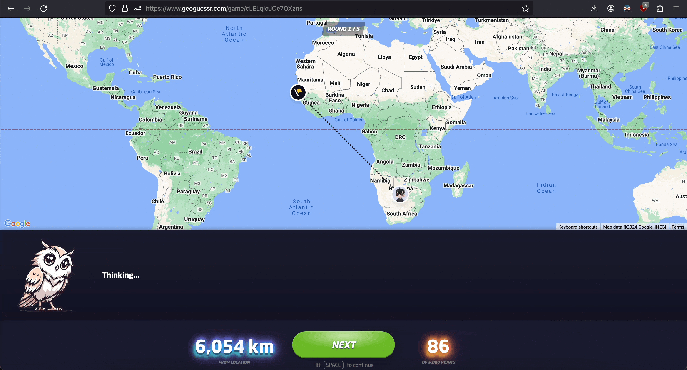
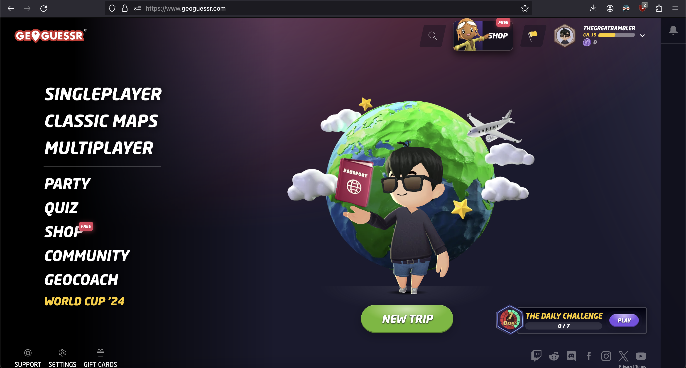
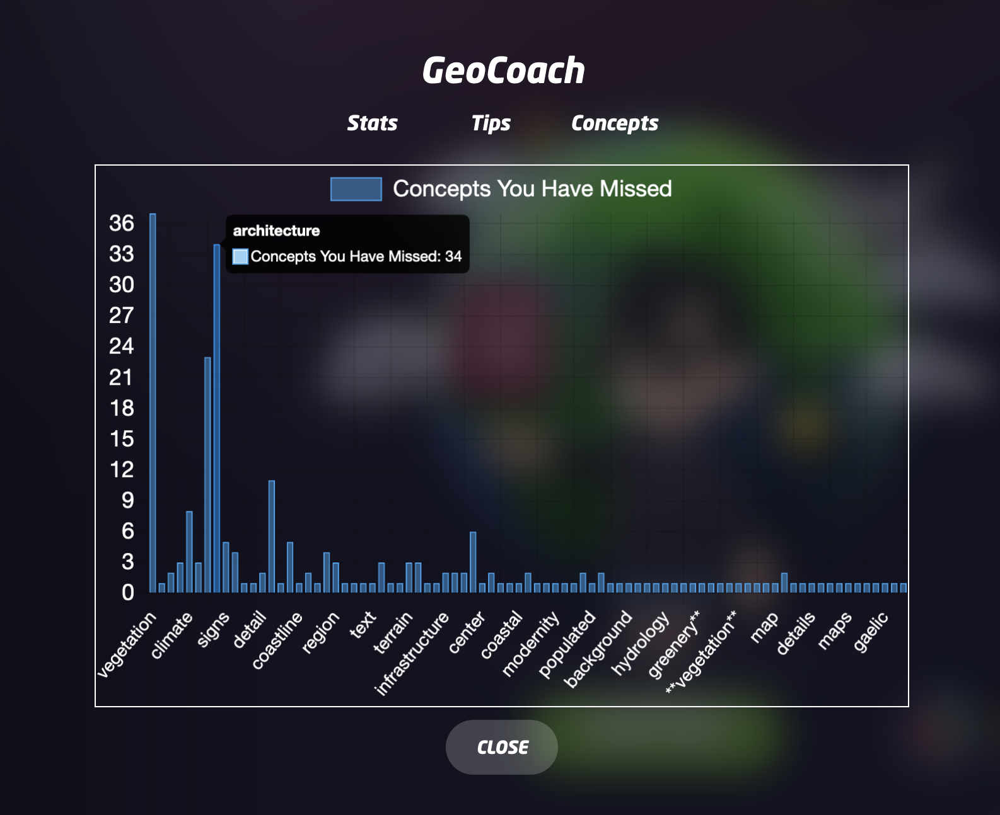
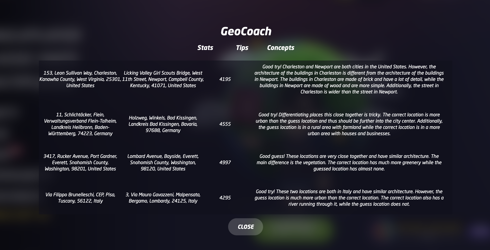
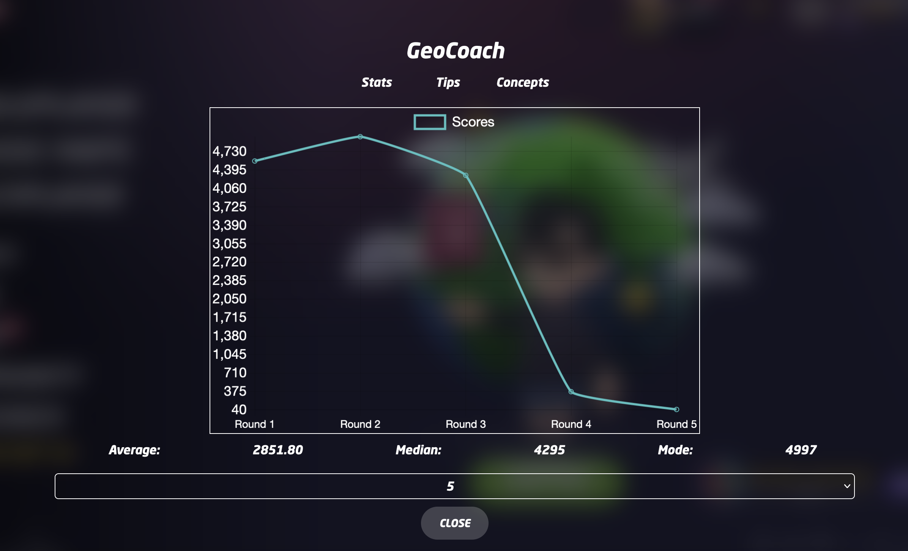

# GeoCoach

GeoCoach is a Chrome/Firefox extension that integrates with the GeoGuessr client in the browser to add a helpful tip-giving coach.

This project won [Third at LAHacks 2024 on the Google challenge out of 193 teams](https://devpost.com/software/geocoach).

After every guess GeoCoach will give you tips on what likely confused you. Namely, it identifies the ways in which the actual location and the location you guessed differ, and how to identify those differences next time. It does this using Google Gemini, both by inputting both locations by name but also by providing images of both locations.

This app is self-hosted. Since the extension integrates directly with the GeoGuessr client the installation is also pretty simple.

## Install
1. Start backend

Create a `.env` file in `backend` with the following format and run `go run .`:
```
GEMINI_API_KEY=
```

2. Start extension

Install the extension from the `manifest.json`. On Firefox this can be done at `about:debugging#/runtime/this-firefox`.

3. Open [GeoGuessr](https://www.geoguessr.com)

## Features

### Tippy, the helpful tip-giving mascot


### Interface


### Concepts you missed


### Past tips


### Past round scores
